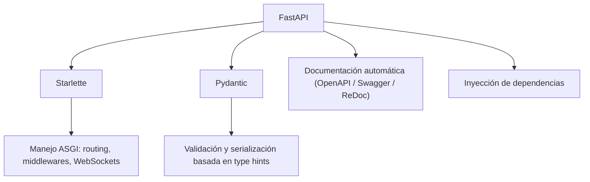
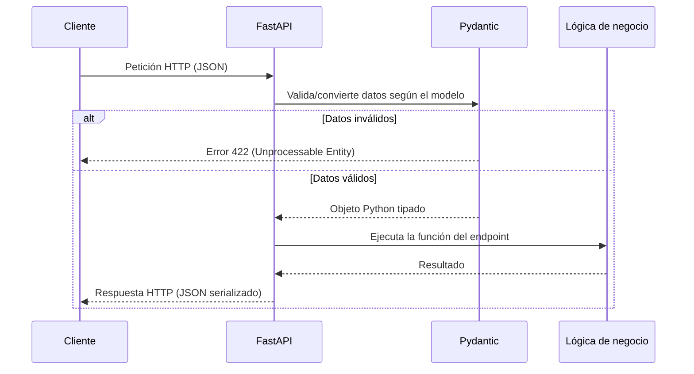
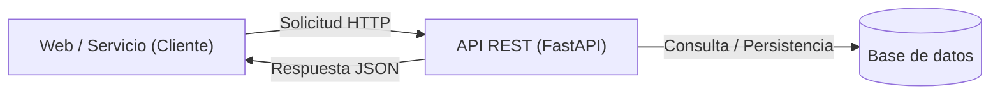

# Qué es FastAPI?

FastAPI es un framework web moderno, de alto rendimiento, diseñado específicamente para la construcción de APIs con Python. Se apoya en los _type hints_ (sugerencias de tipos) estándar del lenguaje, introducidos formalmente a partir de Python 3.6+, para inferir automáticamente la forma de los datos que entran y salen de una aplicación. Esta decisión de diseño no es cosmética: al declarar el tipo de cada parámetro, FastAPI puede validar, serializar, documentar y generar autocompletado de forma automática, sin que el desarrollador tenga que escribir código adicional para cada una de esas tareas por separado. El resultado es un framework que permite crear APIs robustas y eficientes conservando la simplicidad y legibilidad características de Python, motivo por el cual ha sido adoptado tanto por startups como por grandes compañías tecnológicas, y cuenta hoy con una comunidad de código abierto muy activa.

Internamente, FastAPI no reinventa todo desde cero, sino que se construye combinando dos librerías especializadas: **Starlette**, que le aporta toda la capa de manejo de peticiones y respuestas HTTP de manera asíncrona (routing, middlewares, WebSockets, sesiones, etc.), y **Pydantic**, que se encarga de la validación de datos y la serialización basada en los tipos declarados con anotaciones de Python. FastAPI actúa como una capa que orquesta ambas piezas y añade sobre ellas funcionalidades propias, como la generación automática de documentación interactiva y un sofisticado sistema de inyección de dependencias.

Un aspecto teórico clave es que FastAPI está construido sobre el estándar **ASGI** (Asynchronous Server Gateway Interface), a diferencia de frameworks más antiguos como Flask o Django (en su versión clásica), que utilizan **WSGI** (Web Server Gateway Interface), un estándar pensado exclusivamente para código síncrono. ASGI permite manejar tanto código síncrono como asíncrono (`async`/`await`), lo que habilita operaciones de entrada/salida no bloqueantes: mientras una petición espera una respuesta de una base de datos o de otro servicio externo, el servidor puede atender otras peticiones en el mismo hilo, en lugar de quedar bloqueado. Esta característica es una de las razones principales por las que FastAPI alcanza niveles de rendimiento comparables a frameworks de otros ecosistemas tradicionalmente considerados más rápidos para I/O concurrente, como NodeJS (Express) o Go.

## Ventajas de FastAPI

Desde el punto de vista teórico, las ventajas de FastAPI no son afirmaciones aisladas, sino consecuencias directas de sus decisiones de diseño:

- **Rapidez de ejecución (a la par de NodeJS y Go):** al estar basado en Starlette y en el estándar ASGI, y al ejecutarse típicamente sobre servidores ASGI de alto rendimiento como Uvicorn (construido sobre `uvloop` y `httptools`), FastAPI puede manejar un alto volumen de peticiones concurrentes con baja latencia, especialmente en operaciones de I/O como llamadas a bases de datos o APIs externas.
- **Rapidez para desarrollar:** gracias al tipado y a la generación automática de documentación, el ciclo de escribir, probar y depurar código se acorta considerablemente. El editor de código puede ofrecer autocompletado preciso y detección de errores antes de ejecutar el programa, simplemente porque conoce el tipo de cada variable.
- **Reducción de errores humanos (al menos un 40%, según estimaciones de sus propios creadores):** al delegar la validación de tipos y estructuras de datos en Pydantic, se elimina una fuente muy común de bugs: enviar o recibir datos con un formato inesperado. Los errores se detectan en el momento de declarar el modelo, no en producción.
- **Intuitivo y fácil de aprender:** la sintaxis se apoya en conceptos que ya existen en Python estándar (funciones, decoradores, anotaciones de tipos), por lo que no exige aprender una nueva forma de escribir código, solo aplicar convenciones específicas de FastAPI sobre una base ya conocida.
- **Corto, robusto y basado en estándares abiertos:** FastAPI no inventa su propio formato de documentación ni su propio esquema de validación; se basa en especificaciones abiertas y ampliamente adoptadas como **OpenAPI** (antes conocido como Swagger) para describir la API, y **JSON Schema** para describir la forma de los datos. Esto garantiza compatibilidad con un ecosistema enorme de herramientas de terceros (generadores de clientes, validadores, pruebas automatizadas, etc.).

Una de las funcionalidades más valoradas en la práctica, y que se desprende directamente del uso de OpenAPI, es la **documentación interactiva automática**. Por cada endpoint definido en el código, FastAPI genera automáticamente una interfaz navegable (normalmente disponible en las rutas `/docs`, con Swagger UI, y `/redoc`, con ReDoc) donde es posible ver los parámetros esperados, los modelos de entrada y salida, y hasta probar las peticiones directamente desde el navegador, sin necesidad de herramientas externas como Postman.

## Dónde entra en acción?

FastAPI se sitúa del lado del **servidor**: es un framework para desarrollar el **backend** de una aplicación utilizando Python. En una arquitectura cliente-servidor típica, el flujo de comunicación sigue un patrón como el siguiente: un cliente (una aplicación web, móvil o cualquier otro servicio) envía una solicitud a través de una **API REST**; esta API, implementada con FastAPI, procesa la solicitud —posiblemente consultando una base de datos u otros servicios— y devuelve una respuesta, generalmente en formato JSON.

Este modelo es agnóstico respecto a qué consume la API: puede tratarse de una aplicación frontend hecha en React, Vue o Angular, una app móvil nativa, otro microservicio backend, o incluso un script de integración entre sistemas. Precisamente por estar desacoplado del cliente, FastAPI es una opción habitual tanto para construir APIs monolíticas como para sustentar arquitecturas de **microservicios**, donde múltiples servicios pequeños e independientes se comunican entre sí mediante estas mismas interfaces REST (o, en escenarios más avanzados, mediante WebSockets o GraphQL, ambos también soportados por FastAPI gracias a su base en Starlette).

## Quiénes usan o han usado FastAPI?

La adopción de FastAPI por parte de compañías de gran escala es, en cierto modo, una validación práctica de sus fundamentos teóricos: su capacidad de manejar tráfico concurrente elevado con baja latencia, junto con la reducción de errores gracias al tipado estricto, lo convierten en una opción atractiva para sistemas críticos en producción. Entre las empresas que han depositado su confianza en FastAPI se encuentran:

- **Microsoft**
- **Netflix**
- **Uber**

Estas organizaciones lo han incorporado en distintos contextos, desde microservicios internos hasta componentes de sistemas de recomendación o plataformas de datos, lo que refleja la versatilidad del framework más allá de proyectos pequeños o de aprendizaje.

---

Referencias

- [Documentacion](https://fastapi.tiangolo.com/)
- [Pydantic](https://pydantic.dev/docs/validation/latest/get-started/)
- [JSON Schema](https://json-schema.org/)
- [Starlette](https://starlette.dev/)
