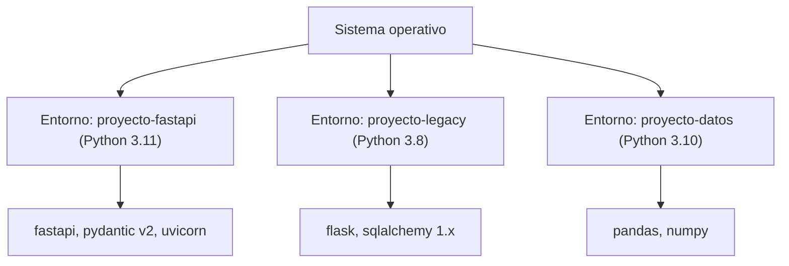
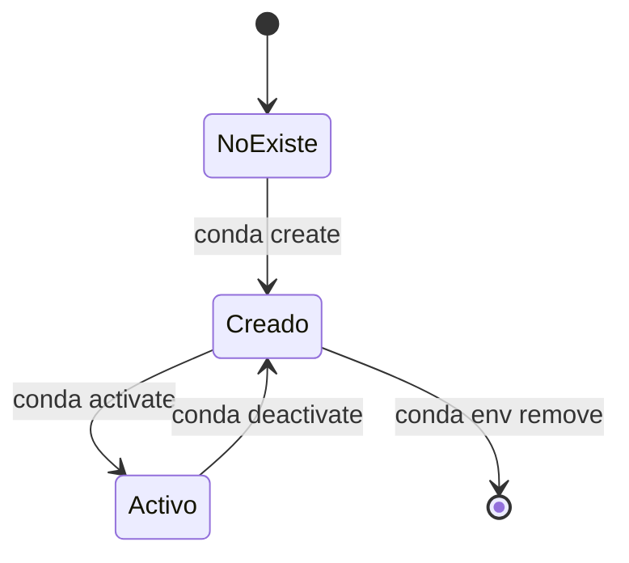
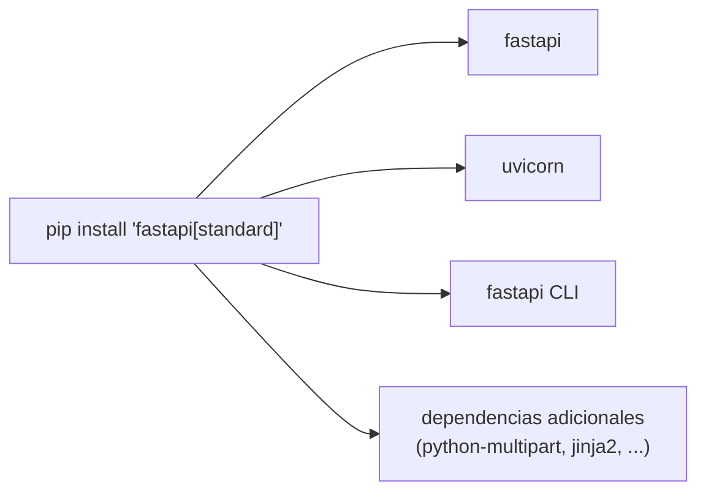

# Instalación del entorno de trabajo

Antes de poder desarrollar con FastAPI es necesario preparar un entorno de trabajo adecuado. En Python, esto implica dos decisiones fundamentales: qué herramienta se usará para gestionar los paquetes y las versiones del intérprete, y cómo se van a **aislar** las dependencias de cada proyecto para evitar conflictos entre ellos. Este documento cubre ambas cuestiones utilizando **Miniconda** como gestor de entornos y **pip** como gestor de paquetes dentro de esos entornos.

## Por qué usar entornos virtuales

Cada proyecto en Python suele depender de versiones concretas de librerías (por ejemplo, una versión específica de FastAPI o de Pydantic). Si todos los proyectos de una misma máquina compartieran el mismo intérprete de Python y las mismas librerías instaladas de forma global, sería prácticamente inevitable que, tarde o temprano, dos proyectos requirieran versiones incompatibles entre sí de una misma dependencia, generando lo que se conoce como **conflicto de dependencias**. Un **entorno virtual** resuelve este problema creando una instalación de Python aislada y autocontenida para cada proyecto, con su propio intérprete y su propio conjunto de paquetes, completamente independiente del resto del sistema.



**Miniconda** es una distribución mínima del gestor de entornos y paquetes **Conda**. A diferencia de otras herramientas de aislamiento como `venv` (incluida en la biblioteca estándar de Python), Conda no se limita a gestionar paquetes de Python: también puede instalar y gestionar el propio intérprete de Python en distintas versiones, además de dependencias de sistema no escritas en Python (como librerías de compilación, bases de datos o herramientas de ciencia de datos). Por eso es especialmente popular en proyectos donde conviven necesidades de backend con necesidades de ciencia de datos o machine learning.

## Instalar Miniconda

La instalación en sistemas Linux se realiza descargando el script oficial de instalación y ejecutándolo. El script se encarga de desplegar Conda en el sistema y de configurar el `PATH` para que el comando `conda` quede disponible en la terminal.

```bash
wget https://repo.anaconda.com/miniconda/Miniconda3-latest-Linux-x86_64.sh
bash Miniconda3-latest-Linux-x86_64.sh
conda --version
conda info # Mas informacion
```

El comando `conda --version` permite verificar que la instalación se completó correctamente, mientras que `conda info` expone información más detallada sobre la configuración activa: la ruta base de la instalación, los canales de descarga de paquetes configurados, la plataforma, y el entorno actualmente activo, entre otros datos útiles para depurar problemas de instalación.

## Ciclo de vida de un entorno con Conda

Trabajar con Conda implica un ciclo recurrente: **crear** un entorno, **activarlo** para empezar a usarlo, trabajar dentro de él instalando y ejecutando paquetes, **desactivarlo** al terminar, y opcionalmente **eliminarlo** si el proyecto ya no lo necesita. Es importante entender que en todo momento solo existe un entorno "activo" por sesión de terminal: al activar uno, la terminal reemplaza temporalmente las rutas del intérprete de Python y de los paquetes por las de ese entorno específico.



Crear un entorno nuevo requiere indicarle un nombre y, opcionalmente, la versión específica del intérprete de Python que debe usar. Esto es especialmente valioso cuando un proyecto exige una versión concreta de Python por compatibilidad con alguna librería:

```bash
conda create <nombre> python=<version especifica>
```

Una vez creado, el entorno debe activarse explícitamente para que la terminal empiece a usar su intérprete y sus paquetes en lugar de los del sistema:

```bash
conda activate <entorno>
```

Cuando se termina de trabajar, o se necesita volver al intérprete global del sistema (o a otro entorno), se desactiva el entorno actual:

```bash
conda deactivate
```

Para consultar qué entornos existen actualmente en el sistema, y así identificar el nombre exacto de cada uno o detectar cuál está activo (normalmente señalado con un asterisco), se usa:

```bash
conda env list
```

Y si un entorno deja de ser necesario —por ejemplo, al finalizar un proyecto o al querer recrearlo desde cero por haber quedado en un estado inconsistente—, puede eliminarse por completo junto con todos los paquetes instalados en él:

```bash
conda env remove -n <entorno>
```

## Activar un entorno en VSCode

Tener un entorno creado y activado en la terminal no significa automáticamente que el editor de código lo esté usando para analizar el proyecto, ofrecer autocompletado o ejecutar/depurar el código. Visual Studio Code necesita que se le indique explícitamente qué intérprete de Python debe usar para la carpeta del proyecto abierta. Esto se hace desde la paleta de comandos:

```text
Ctrl + Shift + P
Python: Select interpreter
```

Al ejecutar este comando, VSCode listará los intérpretes de Python detectados en el sistema, incluidos los asociados a los entornos de Conda creados previamente, permitiendo seleccionar el que corresponde al proyecto actual. Este paso es fundamental: si se selecciona un intérprete incorrecto (por ejemplo, el del sistema en lugar del entorno del proyecto), el editor no reconocerá los paquetes instalados dentro del entorno, mostrando errores de importación aunque el código sea correcto.

## Instalación de FastAPI

Con el entorno virtual creado y activado, el último paso es instalar FastAPI dentro de él mediante `pip`, el gestor de paquetes estándar de Python:

```bash
pip install "fastapi[standard]"
```

La sintaxis `fastapi[standard]` hace uso de los llamados **extras** de `pip`: un mecanismo que permite instalar, junto al paquete principal, un conjunto adicional de dependencias opcionales agrupadas bajo un nombre. En este caso, el extra `standard` instala no solo el núcleo de FastAPI, sino también las herramientas que conforman el flujo de trabajo habitual de desarrollo, entre ellas:

- **Uvicorn**, el servidor ASGI recomendado para ejecutar la aplicación tanto en desarrollo como en producción.
- El comando **`fastapi`** (FastAPI CLI), que simplifica el arranque del servidor de desarrollo (con recarga automática) y del servidor de producción.
- Dependencias necesarias para funcionalidades adicionales como formularios (`python-multipart`), plantillas (`jinja2`) o soporte de correo, según la versión.

Instalar FastAPI sin el extra (`pip install fastapi`) también es una opción válida, pero deja fuera estas herramientas, dejando la responsabilidad de instalar y configurar por separado un servidor ASGI y las demás dependencias del flujo de desarrollo; ese enfoque suele reservarse para entornos de producción donde se quiere un control más granular de exactamente qué se instala.


