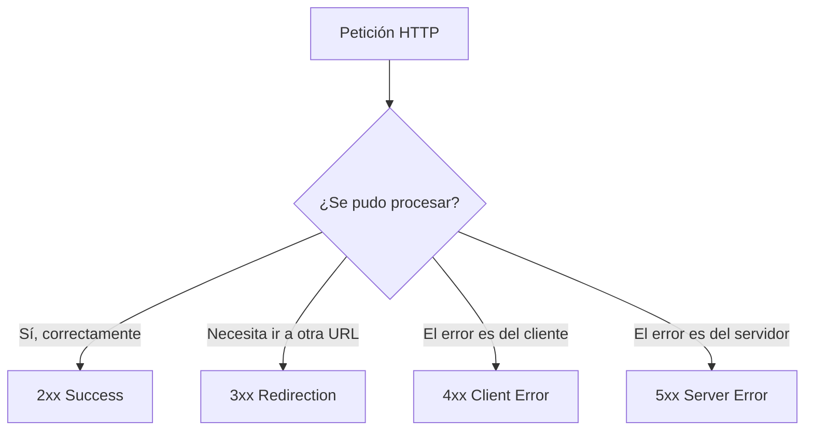

# Métodos HTTP

Los métodos HTTP (también llamados verbos HTTP) indican la acción que el cliente quiere realizar sobre un recurso identificado por una URL. Elegir el método correcto para cada operación no es solo una convención estética: de él dependen comportamientos reales como si el navegador cachea la respuesta, si un proxy o un cliente puede reintentar la petición automáticamente, o si es seguro repetirla varias veces sin efectos secundarios (lo que se conoce como **idempotencia**).

- **GET:** Solicita la representación de un recurso específico. Solo recupera datos y no debería provocar ningún cambio de estado en el servidor. Es un método seguro (*safe*) e idempotente: hacer la misma petición GET una vez o cien veces produce el mismo resultado. Se usa, por ejemplo, para listar los animes de una colección o para consultar el detalle de uno en concreto.
- **POST:** Envía una entidad a un recurso específico, causando a menudo un cambio de estado o efectos secundarios en el servidor. No es idempotente: enviar la misma petición POST dos veces (por ejemplo, crear un anime) normalmente genera dos recursos distintos, salvo que el servidor implemente alguna lógica adicional para evitarlo.
- **PUT:** Reemplaza por completo la representación actual del recurso de destino con la carga útil de la petición. Es idempotente: aplicar el mismo PUT varias veces deja el recurso en el mismo estado final. Se usa cuando se quiere sobrescribir un recurso entero, por ejemplo actualizar todos los campos de un anime a la vez.
- **PATCH:** Se utiliza para aplicar modificaciones parciales a un recurso, enviando únicamente los campos que cambian en lugar de la representación completa. A diferencia de PUT, no siempre es idempotente, ya que depende de cómo se implemente la modificación (por ejemplo, un PATCH que incrementa un contador en 1 no es idempotente).
- **DELETE:** Elimina un recurso específico. Es idempotente en el sentido de que borrar el mismo recurso varias veces deja el sistema en el mismo estado (el recurso no existe), aunque la segunda petición pueda responder con un 404 en lugar de un 200.
- **HEAD:** Es idéntico a GET, pero el servidor solo devuelve las cabeceras de la respuesta, sin el cuerpo. Es útil para comprobar si un recurso existe, obtener su tamaño o su fecha de modificación sin transferir todo el contenido, por ejemplo antes de descargar un archivo grande.
- **OPTIONS:** Se utiliza para consultar qué métodos y opciones de comunicación soporta un recurso o el servidor, sin ejecutar ninguna acción sobre él. Es el método que los navegadores envían automáticamente antes de ciertas peticiones **CORS** (la llamada *preflight request*) para verificar si el servidor permite la petición real que se quiere hacer desde otro origen.
- **TRACE:** Devuelve la petición tal y como fue recibida por el servidor, principalmente con fines de diagnóstico, para ver si (y cómo) fue modificada por servidores o proxys intermedios en el camino. Su uso está muy restringido en la práctica por motivos de seguridad.
- **CONNECT:** Establece un túnel hacia el servidor identificado por el recurso solicitado, generalmente usado para habilitar conexiones HTTPS a través de un proxy.

De estos métodos, GET, POST, PUT, PATCH y DELETE son los que se usan de forma habitual al diseñar una API REST, mientras que HEAD, OPTIONS, TRACE y CONNECT cumplen roles más específicos de infraestructura, diagnóstico o negociación entre cliente y servidor.

## Códigos de estado (status codes)

Cada respuesta HTTP incluye un código de estado numérico de tres dígitos que resume el resultado de la petición. El primer dígito agrupa el código en una categoría general, lo que permite a un cliente reaccionar de forma razonable incluso ante un código que no reconoce específicamente, con solo fijarse en esa primera cifra:

- **2xx — Success:** la petición fue recibida, entendida y procesada correctamente.
- **3xx — Redirection:** se necesitan acciones adicionales, normalmente seguir a otra URL, para completar la petición.
- **4xx — Client Error:** la petición contiene un error atribuible al cliente (datos inválidos, falta de autenticación, recurso inexistente, etc.).
- **5xx — Server Error:** el servidor falló al procesar una petición que en principio era válida.

### 2xx — Success

- **200 OK:** la petición se procesó correctamente. Es el código más común para un GET exitoso, por ejemplo al consultar la lista completa de animes o el detalle de uno existente.
- **201 Created:** el servidor creó un nuevo recurso como resultado de la petición. Se ve típicamente como respuesta a un POST exitoso, por ejemplo al añadir un nuevo anime a la colección.
- **202 Accepted:** la petición fue aceptada para ser procesada, pero el procesamiento aún no ha finalizado. Es habitual en operaciones asíncronas o en cola, como el envío de un trabajo pesado que se resolverá más tarde en segundo plano.
- **204 No Content:** la petición se procesó correctamente, pero no hay contenido que devolver en el cuerpo de la respuesta. Es común como respuesta a un DELETE exitoso, donde no tiene sentido devolver el recurso que se acaba de eliminar.

### 3xx — Redirection

- **301 Moved Permanently:** el recurso solicitado se movió de forma permanente a una nueva URL. Ocurre, por ejemplo, cuando una API cambia de dominio o de versión y se quiere redirigir automáticamente el tráfico antiguo.
- **302 Found:** el recurso se encuentra temporalmente en una URL distinta. Se usa cuando la redirección no es definitiva, por ejemplo tras completar un inicio de sesión antes de volver a la página original.
- **304 Not Modified:** indica al cliente que el recurso no ha cambiado desde la última vez que lo consultó, por lo que puede seguir usando la versión que tiene en caché. Se produce cuando el cliente envía cabeceras condicionales (como `If-None-Match`) y el servidor confirma que el contenido sigue siendo el mismo.

### 4xx — Client Error

- **400 Bad Request:** la petición está mal formada o contiene datos que el servidor no puede interpretar, por ejemplo un JSON con una sintaxis inválida.
- **401 Unauthorized:** la petición requiere autenticación y esta no se proporcionó o no es válida. Se ve al intentar acceder a un endpoint protegido sin enviar un token válido.
- **403 Forbidden:** el cliente está autenticado, pero no tiene permisos suficientes para realizar la acción solicitada, por ejemplo un usuario normal intentando borrar el anime de otro usuario o acceder a un endpoint solo para administradores.
- **404 Not Found:** el recurso solicitado no existe. Aparece, por ejemplo, al consultar por su id un anime que nunca fue creado o que ya fue eliminado.
- **405 Method Not Allowed:** el recurso existe, pero no soporta el método HTTP utilizado, por ejemplo enviar un POST a una URL que solo acepta peticiones GET.
- **409 Conflict:** la petición entra en conflicto con el estado actual del recurso, por ejemplo al intentar crear un anime con un título que debe ser único y que ya existe.
- **422 Unprocessable Entity:** la petición está bien formada sintácticamente, pero contiene datos que no cumplen las reglas de validación esperadas. Es el código que FastAPI devuelve automáticamente cuando los datos enviados no coinciden con el modelo de Pydantic declarado en el endpoint, por ejemplo enviar un texto donde se espera un número.
- **429 Too Many Requests:** el cliente ha superado el límite de peticiones permitido en un periodo de tiempo. Se ve en APIs que implementan *rate limiting* para protegerse de abuso o de picos de tráfico excesivos.

### 5xx — Server Error

- **500 Internal Server Error:** ocurrió un error inesperado en el servidor mientras procesaba la petición, normalmente por una excepción no controlada en el código del endpoint.
- **501 Not Implemented:** el servidor no reconoce el método de la petición o no tiene la capacidad de completarla, por ejemplo al llamar a un endpoint planeado pero aún no implementado.
- **502 Bad Gateway:** el servidor, actuando como puerta de enlace o proxy, recibió una respuesta inválida de un servidor upstream. Suele darse cuando el backend real (por ejemplo, la aplicación FastAPI) se cae o no responde y un proxy inverso como Nginx queda esperando una respuesta que nunca llega correctamente.
- **503 Service Unavailable:** el servidor no está disponible temporalmente, normalmente por sobrecarga o por estar en mantenimiento. Es habitual verlo justo durante un despliegue o un reinicio del servicio.
- **504 Gateway Timeout:** el servidor, actuando como puerta de enlace o proxy, no recibió una respuesta a tiempo del servidor upstream. Ocurre, por ejemplo, cuando una consulta a la base de datos tarda demasiado y el proxy corta la espera antes de que el backend termine de procesarla.
