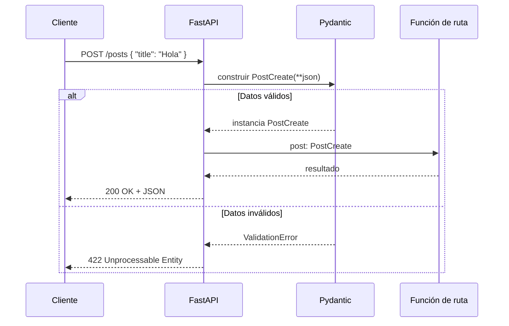

# Validaciones automaticas con Pydantic

Python es un lenguaje de tipado dinámico: una variable puede contener un `int` en un momento y un `str` en el siguiente, y el intérprete no se queja hasta que ese valor se usa de una forma incompatible con lo que realmente es. Esa flexibilidad es cómoda para escribir scripts rápidos, pero es un problema serio cuando el código recibe datos desde fuera del programa, como el body de una petición HTTP. Ese JSON que llega desde un cliente no tiene ninguna garantía: puede faltarle un campo, puede traer un texto donde se esperaba un número, o puede traer tipos completamente inesperados. Si el código de la API asumiera ingenuamente que esos datos ya vienen "bien formados", cualquier entrada rara terminaría provocando un error a mitad de la lógica de negocio, con un traceback confuso y, en el peor caso, un comportamiento incorrecto que ni siquiera lanza una excepción.

La idea central de la validación automática con Pydantic es mover ese problema a un único punto, muy al principio del flujo de la petición, en vez de dejarlo disperso por todo el código. En lugar de confiar en que el diccionario que llega tiene las claves correctas, se declara explícitamente cómo debería lucir ese dato mediante una clase que hereda de `BaseModel`. Esa clase actúa como un contrato: describe los campos que existen y el tipo que cada uno debe tener. Cuando FastAPI recibe una petición cuyo endpoint espera un parámetro de ese tipo, no le entrega el JSON crudo a la función; primero lo hace pasar por Pydantic, que intenta construir una instancia del modelo a partir de esos datos. Si la construcción tiene éxito, la función de la ruta recibe un objeto ya validado y con tipos garantizados. Si falla, la función ni siquiera llega a ejecutarse: FastAPI devuelve automáticamente una respuesta con código 422 y una descripción detallada de qué campo falló y por qué.

Esto es lo que explica, en el fondo, por qué se pueden construir APIs bastante robustas en un lenguaje que por diseño no obliga a declarar tipos. La robustez no viene de que Python "se haya vuelto" un lenguaje de tipado estricto, sino de que se introduce una frontera clara entre el mundo exterior (no confiable, sin garantías) y el mundo interior del programa (donde sí se puede confiar en la forma de los datos). Toda la incertidumbre se concentra y se resuelve una sola vez, en el momento en que Pydantic valida el modelo; una vez que esa validación pasa, el resto del código puede trabajar con `post.title` sabiendo con certeza que es un `str`, sin necesidad de volver a comprobarlo en cada función que lo use.

## Qué significa "validar" para Pydantic

Validar no es simplemente comprobar `isinstance(valor, tipo)`. Pydantic distingue, para cada tipo, un conjunto de valores que acepta directamente y otro conjunto de valores que puede _coaccionar_ (convertir) a ese tipo si la conversión es razonable y no ambigua. Por ejemplo, un campo declarado como `int` acepta un `int` tal cual, pero también acepta el string `"42"` (lo convierte a `42`) o un `float` sin parte decimal como `42.0`. En cambio, no acepta `"cuarenta y dos"` ni `42.5`, porque no hay una forma segura de convertir esos valores sin perder información o inventar un significado. Este comportamiento se suele llamar modo "lax" (flexible), y es el que usa Pydantic por defecto; también existe un modo "strict" para los casos donde se prefiere rechazar cualquier valor que no sea exactamente del tipo declarado, sin conversiones.

Esta distinción importa porque explica por qué la validación de Pydantic no es una simple lista de `if isinstance(...)`. El modelo no solo pregunta "¿es del tipo correcto?", sino "¿puede convertirse de forma inequívoca al tipo correcto?". Esa pequeña diferencia es la que le permite a una API aceptar tanto JSON estrictamente tipado (donde los números ya llegan como números) como JSON donde, por ejemplo, un formulario HTML envía todo como texto, sin que quien escribe el endpoint tenga que preocuparse por hacer esas conversiones a mano.

## El ciclo de una petición validada

Es útil pensar el recorrido completo de una petición para ubicar en qué momento exacto interviene la validación:



Lo importante de este diagrama es que la función de la ruta (`create_post`, en el proyecto de este curso) nunca se entera de que hubo un problema con los datos: si el flujo llega hasta ella, es porque Pydantic ya garantizó que `post.title` y `post.content` existen y son strings. Toda la rama de error se resuelve antes, de forma genérica, sin que cada desarrollador tenga que escribir ese manejo de errores una y otra vez.

## Qué significa un mensaje de error de validación

Cuando la validación falla, Pydantic no se limita a decir "hubo un error": construye una lista con un elemento por cada campo que falló, indicando la ubicación exacta del problema (`loc`), un mensaje legible (`msg`) y el tipo de error (`type`). Un ejemplo típico, para el modelo `PostCreate` de este proyecto, si se envía un `title` numérico en vez de texto:

```json
{
  "detail": [
    {
      "loc": ["body", "title"],
      "msg": "Input should be a valid string",
      "type": "string_type"
    }
  ]
}
```

Este formato estructurado es lo que permite que cualquier cliente de la API (un frontend, otra API, una app móvil) pueda interpretar el error de forma programática, en vez de tener que hacer _parsing_ de un mensaje de texto libre que cambia según quién escribió esa validación. Esa uniformidad es una de las razones por las que se dice que Pydantic ayuda a construir APIs robustas: no solo rechaza datos incorrectos, sino que lo hace siempre de la misma manera.

## Los límites de la validación automática

Es importante tener claro qué es lo que Pydantic garantiza y qué es lo que no. Pydantic garantiza la _forma_ de los datos: que un campo exista, que tenga el tipo declarado (o algo convertible a él) y, si se usan herramientas adicionales como `Field` con restricciones (`min_length`, `gt`, `pattern`, etc.), que cumpla ciertas reglas simples sobre ese valor. Lo que Pydantic no garantiza por sí solo es la validez de negocio: por ejemplo, que el `id` de un post enviado en una actualización realmente exista en la base de datos, o que un usuario tenga permiso para editar ese post en particular. Ese tipo de reglas sigue siendo responsabilidad del código de la aplicación, normalmente dentro de la función de la ruta, después de que los datos ya pasaron la validación de forma.

También vale la pena notar que la validación ocurre en la frontera de entrada (y, si se usa un `response_model`, también en la frontera de salida), pero no protege mágicamente el código intermedio. Si dentro de una función se reasigna una variable validada a otro valor sin pasar de nuevo por un modelo, Python no impedirá que esa variable termine con un tipo distinto. La robustez que aporta Pydantic depende de mantener la disciplina de modelar los datos en los puntos de entrada y salida del sistema; no reemplaza por completo la necesidad de escribir código cuidadoso en el resto del programa, pero reduce enormemente la superficie donde pueden colarse errores de tipo.
